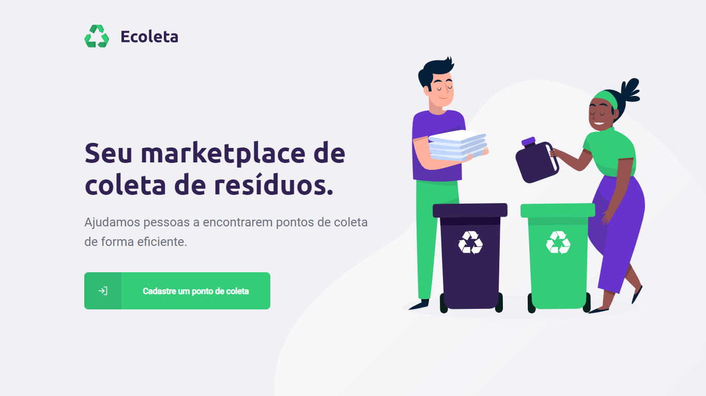

<h1 align=center>
  
</h1>

<div align="center">

![GitHub issues][github_issues_badge] ![GitHub][repository_license_badge] ![Node_Badge][node_version_badge] ![Npm_Badge][npm_version_badge] ![React_Badge][web_react_badge] ![React_Native_Badge][mobile_react-native_badge] ![NodeJS_Badge][server_nodejs_badge] [](https://github.com/ellerbrock/typescript-badges/)
  <a href="https://rocketseat.com.br">
    
  </a>

</div>

<h3 align="center">

♻️ Ecoleta é um projeto **Open Source** desenvolvido na semana **Next Level Week (1.0)** da **[Rocketseat][rocketseat_site]** utilizando as tecnologias ***TypeScript, Node, React e React Native***.

</h3>

## **:rocket: OBJETIVO**

O projeto tem como finalidade **estabelecer uma conexão** entre **empresas e/ou entidades que coletam resíduos** (orgânicos e inorgânicos) **às pessoas e/ou entidades que necessitam constantemente descartar esses resíduos**. Solucionando um grande problema recorrente que é o **descarte inadequado do lixo**, facilitando o processo de recliclagem e reutilização.


## **:computer: TECNOLOGIAS**


#### **Web** ([React][react] + [TypeScript][typescript])

  - **[React Router Dom][react_router_dom]**
  - **[React Icons][react_icons]**
  - **[Axios][axios]**
  - **[Leaflet][leaflet]**
  - **[React Leaflet][react_leaflet]**
  - **[React Dropzone][react_dropzone]**  

#### **Backend** ([NodeJS][node] + [TypeScript][typescript])

  - **[Express][express]**
  - **[CORS][cors]**
  - **[KnexJS][knex]**
  - **[SQLite][sqlite3]**
  - **[ts-node][tsnode]**
  - **[dotENV][dotenv]**
  - **[Multer][multer]**
  - **[Celebrate][celebrate]**
  - **[Joi][joi]** 

#### **Mobile** ([React Native][react_native] + [TypeScript][typescript])

  - **[Expo][expo]**
  - **[Expo Google Fonts][expo_google_fonts]**
  - **[React Navigation][react_navigation]**
  - **[React Native Maps][react_native_maps]**
  - **[Expo Constants][expo_constants]**
  - **[React Native SVG][react_native_svg]**
  - **[Axios][axios]**
  - **[Expo Location][expo_location]**
  - **[Expo Mail Composer][expo_mail_composer]**  

#### **Utilitários**

- API: **[IBGE API][ibge_api]** &rarr; **<kbd>[API de UFs][ibge_api_ufs]</kbd>**, **<kbd>[API de Municípios][ibge_api_municipios]</kbd>** 
- Maps: **[Leaflet][leaflet]**


## **:wine_glass: COMO UTILIZAR**


Instale as dependências contidas nos arquivos `package.json` que se encontram nos diretórios **backend**, **web** e **mobile**. Para instalar as dependências com o comando:

```sh
$ npm install

# ou
$ yarn
```

Exemplos:
```sh
# Instalando as dependências do backend:
$ cd ./backend
$ npm install

# Instalando as dependências do web:
$ cd ./web
$ npm install

# Instalando as dependências do mobile:
$ cd ./mobile
$ npm install
```

### Utilizando o backend

```sh
# Abrindo o terminal no diretório do servidor:
$ cd ./backend

# Executando a aplicação em modo de desenvolvimento:
$ npm run dev

# Instanciando o banco de dados:
$ npm run knex:migrate

# Povoando o banco de dados (seeds):
$ npm run knex:seed
```
### Utilizando o Website

```sh
# Abrindo o terminal no diretório do website:
$ cd ./web

# Executando o web no modo de desenvolvimento:
$ npm run start
```

> Se o browser não abrir automaticamente, acesse: http://localhost:3000.

### Utilizando o Mobile

Instale o aplicativo <kbd>[Expo](https://play.google.com/store/apps/details?id=host.exp.exponent&hl=en)</kbd> no seu smartphone.

```sh
# Abrindo o terminal no diretório do mobile:
$ cd ./mobile

# Executando o mobile no modo de desenvolvimento:
$ npm run start
```

Agora, abra o aplicativo do expo e no modo **LAN** faça o scan do QRCode.

Se tiver algum problema com as fontes, utilize o comando:
```sh
$ expo install expo-font @expo-google-fonts/ubuntu @expo-google-fonts/roboto
```

## **:books: REFERÊNCIAS**

- [React + TypeScript Cheat Sheet](https://github.com/typescript-cheatsheets/react-typescript-cheatsheet)
- [Blog Rocketseat](https://blog.rocketseat.com.br/)
- [ReactJS](https://reactjs.org/docs/getting-started.html) | [ReactJS pt-BR](https://pt-br.reactjs.org/docs/getting-started.html)
- [TypeScript](https://www.typescriptlang.org/docs/home.html)
- [React Native](https://reactnative.dev/docs/getting-started)
- [Expo](https://expo.io/learn)
- [Knex][knex]
- [Express](https://expressjs.com/pt-br/)
- [Node](https://nodejs.org/en/)
- [Celebrate](https://github.com/arb/celebrate)
- [Joi](https://hapi.dev/module/joi/)

<!-- Badges -->

[github_issues_badge]: https://img.shields.io/github/issues/x0n4d0/ecoleta?color=green

[repository_license_badge]: https://img.shields.io/github/license/x0n4d0/ecoleta

[node_version_badge]: https://img.shields.io/badge/node-12.17.0-green

[npm_version_badge]: https://img.shields.io/badge/npm-6.14.4-red

[web_react_badge]: https://img.shields.io/badge/web-react-blue

[mobile_react-native_badge]: https://img.shields.io/badge/mobile-react%20native-blueviolet

[server_nodejs_badge]: https://img.shields.io/badge/server-nodejs-important

<!-- Techs -->

[react]: https://reactjs.org/

[typescript]: https://www.typescriptlang.org/

[node]: https://nodejs.org/en/

[leaflet]: https://react-leaflet.js.org/en/

[ibge_api]: https://servicodados.ibge.gov.br/api/docs/localidades?versao=1

[ibge_api_ufs]: https://servicodados.ibge.gov.br/api/docs/localidades?versao=1#api-UFs-estadosGet

[ibge_api_municipios]: https://servicodados.ibge.gov.br/api/docs/localidades?versao=1#api-Municipios-estadosUFMunicipiosGet

[vscode]: https://code.visualstudio.com/

[react_native]: http://www.reactnative.com/

[stackedit]: https://stackedit.io

[vscode_sqlite_extension]: https://marketplace.visualstudio.com/items?itemName=alexcvzz.vscode-sqlite

[markdown_emoji]: https://gist.github.com/rxaviers/7360908

[commitlint]: https://github.com/conventional-changelog/commitlint

[express]: https://expressjs.com/

[cors]: https://expressjs.com/en/resources/middleware/cors.html

[knex]: http://knexjs.org/

[sqlite3]: https://github.com/mapbox/node-sqlite3

[tsnode]: https://github.com/TypeStrong/ts-node

[feather_icons]: https://feathericons.com/

[insomnia]: https://insomnia.rest/

[react_leaflet]: https://react-leaflet.js.org/

[react_router_dom]: https://github.com/ReactTraining/react-router/tree/master/packages/react-router-dom

[react_icons]: https://react-icons.github.io/react-icons/

[axios]: https://github.com/axios/axios

[dotenv]: https://github.com/motdotla/dotenv

[expo]: https://expo.io/

[expo_google_fonts]: https://github.com/expo/google-fonts

[react_navigation]: https://reactnavigation.org/

[react_native_maps]: https://github.com/react-native-community/react-native-maps

[expo_constants]: https://docs.expo.io/versions/latest/sdk/constants/

[react_native_svg]: https://github.com/react-native-community/react-native-svg

[expo_location]: https://docs.expo.io/versions/latest/sdk/location/

[expo_mail_composer]: https://docs.expo.io/versions/latest/sdk/mail-composer/

[font_roboto]: https://fonts.google.com/specimen/Roboto

[font_ubuntu]: https://fonts.google.com/specimen/Ubuntu

[font_awesome]: https://fontawesome.com/

[multer]: https://github.com/expressjs/multer

[celebrate]: https://github.com/arb/celebrate

[joi]: https://github.com/hapijs/joi

[react_dropzone]: https://github.com/react-dropzone/react-dropzone

[asdf]: https://github.com/asdf-vm/asdf

[yarn]: https://classic.yarnpkg.com/en/docs/install/#debian-stable
